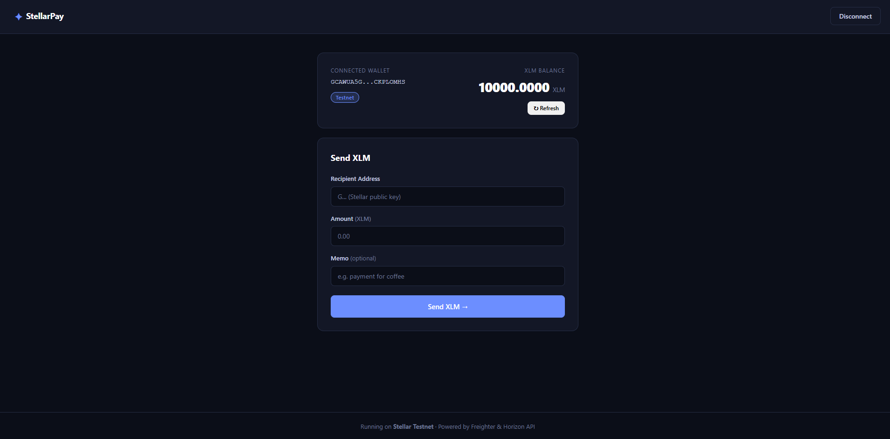
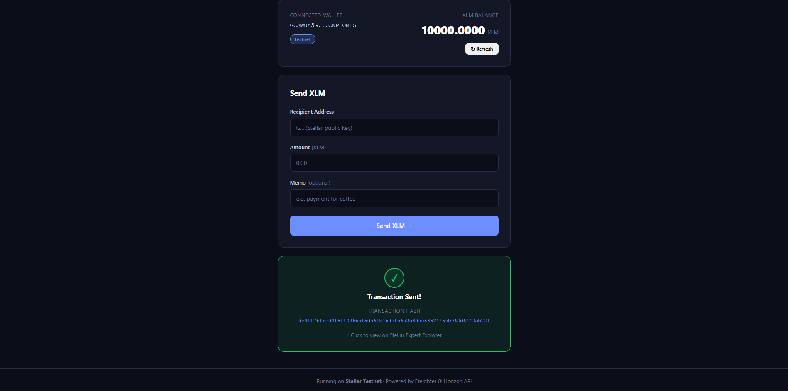
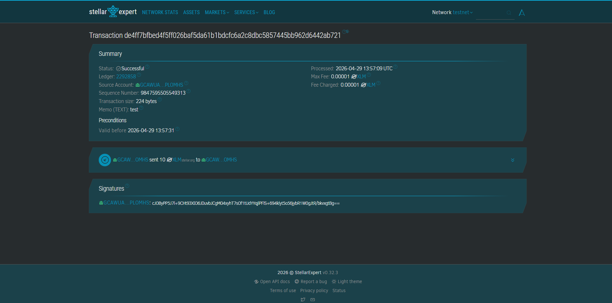

# StellarPay — Stellar Testnet Payment dApp

A simple XLM payment dApp built on the Stellar Testnet. Connect your Freighter wallet, check your balance, and send XLM to any address — all in one clean interface.

## Features

- **Wallet Connect / Disconnect** — Freighter browser extension integration
- **Live XLM Balance** — fetched directly from Stellar Testnet via Horizon API
- **Send XLM** — build, sign, and submit transactions on Stellar Testnet
- **Transaction Feedback** — success state with transaction hash (links to Stellar Expert) or clear error messages
- **Memo support** — attach an optional text memo to any payment

## Tech Stack

- React 19 + Vite
- `@stellar/freighter-api` v6 — wallet connection & transaction signing
- `@stellar/stellar-sdk` v15 — transaction building & Horizon API

## Prerequisites

1. Install the [Freighter wallet browser extension](https://freighter.app)
2. In Freighter settings, switch the network to **Testnet**
3. Fund your testnet wallet using [Stellar Friendbot](https://friendbot.stellar.org)

## Setup & Run Locally

```bash
# 1. Clone the repo
git clone https://github.com/Ayushjo/stellar-payment-dapp.git
cd stellar-payment-dapp

# 2. Install dependencies
npm install

# 3. Start the dev server
npm run dev
```

Open [http://localhost:5173](http://localhost:5173) in your browser.

## Build for Production

```bash
npm run build
npm run preview
```

## Usage

1. Click **Connect Freighter Wallet** and approve the connection in the extension popup
2. Your wallet address and XLM balance will appear
3. Enter a recipient Stellar address (G...), an amount, and an optional memo
4. Click **Send XLM →** — Freighter will pop up to sign the transaction
5. After signing, the transaction is submitted to the Stellar Testnet
6. A success card shows the transaction hash with a link to Stellar Expert

## Screenshots

### Wallet Connected & Balance Displayed


### Successful Testnet Transaction


### Transaction Hash Shown to User


## License

MIT
